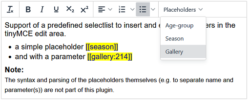

# tinyMCE-Placeholder

 
  
 [](https://www.paypal.me/SKientzler/5.00EUR)

- [Description](#description)
- [Installation](#installation)
  - [Usage as external plugin](#usage-as-external-plugin)
  - [Usage as internal plugin](#usage-as-internal-plugin)
- [Configuration](#configuration)
  - [Defining the available placeholder list](#defining-the-available-placeholder-list)
  - [Add the selectlist to the toolbar](#add-the-selectlist-to-the-toolbar)
  - [Choose the start- and end- tag](#choose-the-start--and-end--tag)
  - [Specify the style to display the placeholders](#specify-the-style-to-display-the-placeholders-within-the-edit-area)
  - [Enable/disable the placeholder edit dialog](#enabledisable-the-placeholder-edit-dialog)
- [Localization](#localization)

---
## Description

**Plugin for tinyMCE (Version 6.x) to insert and edit placeholders.**

This plugin supports a defineable selectlist to insert a placeholder into the currrent
edit area. Placeholders are often used/needed to replace some part in a text at runtime 
with any dynamic content.  
A placeholders is specified with a name (possibly with additional parameter(s)), which 
is enclosed within a defined start and end tag. This plugin supports following start- 
and end tags:
- curly_braces:	`{placeholder}`
- square_braces: `[placeholder]`
- double_curly_braces: `{{placeholder}}`    (*e.g. used by the TWIG template engine*)
- double_square_braces: `[[placeholder]]`
- curly_brace_exclamation: `{!placeholder!}`
- square_brace_exclamation: `[!placeholder!]`

To visually differentiate from 'normal' content, the display of placeholders can be 
defined using CSS styles. Existing placeholders are read-only and cannot be edited or 
changed directly in the edit area:



Editing via a dialog (e.g. to enter parameters of a placeholder) can be activated or 
deactivated. If this option is set (default: true), a double click on a placeholder
opens a dialog to edit the value of the placeholder:


## Installation

Download the latest release and save the `placeholder` folder 
1. In any path on your server as 'external plugin'
2. In the 'plugin' folder of your self hosted version of **tinyMCE** to use it as
   'internal plugin'
   
### Usage as 'external plugin'

If you are loading tinyMCE from a CDN or want to separate your custom plugins
from the core installation, you have to load placeholder as external plugin:

```JS
tinymce.init({
  selector: 'your_editor',
  external_plugins: {
    'placeholder': 'http://www.yourdomain.com/yourplugins/placeholder/plugin.min.js',
  }
});
```

Loading as external plugin, you can use either the `plugin.min.js`or the `plugin.js` 
version - regardless of the version of ***tinyMCE*** (`tinymce.js / tinymce.min.js`)
you have loaded!
> The `.min.js` file is a compressed/minified version of the `.js` file. Using the 
> full version takes longer to load but the source is readable and allows debuging.

For details, especially regarding the absolute or relative path of the plugin URL, 
see:  
https://www.tiny.cloud/docs/tinymce/6/editor-important-options/#external_plugins
   
### Usage as 'internal plugin'

To load placeholder as internal plugin, the `placeholder` folder **MUST** be a
subfolder of the `plugins` directory of your ***tinyMCE*** installation.

```JS
tinymce.init({
  selector: 'your_editor',
  plugins: 'plugin1 ... pluginN placeholder',
});
```

Dependent on the version of ***tinyMCE*** (`tinymce.js / tinymce.min.js`) you
are loading, the corresponding version of the plugin must be available on your
installation.

For details see:  
https://www.tiny.cloud/docs/tinymce/6/editor-important-options/#plugins

## Configuration

### Defining the available placeholder list

To specify the available placeholders, the option `placeholders` have to be set when
initializing ***tinyMCE***.  

The placeholder list can be defined in short or long form:
- short: Just define an array of strings containing the available placeholders 
  (The placholder name is set to its value!)
- long: define an array of abjects containing `name`and `value` properties. This opens
  the posibility to localize the placeholdernames without changing the internal value.

```JS
// 'long' version
tinymce.init({
  selector: 'your_editor',
  external_plugins: {
    'placeholder': 'http://www.yourdomain.com/yourplugins/placeholder/plugin.min.js',
  }
  placeholders: [
    {
      name:  'Age-group',
      value: 'age-group:XX'
    }, {
      name:  'Season',
      value: 'season'
    }, {
      name:  'Gallery',
      value: 'gallery:XX'
    }
  ],
});

// 'short' version
tinymce.init({
  selector: 'your_editor',
  external_plugins: {
    'placeholder': 'http://www.yourdomain.com/yourplugins/placeholder/plugin.min.js',
  }
  placeholders: ['age-group:XX', 'season', 'gallery:XX']
});
```

### Add the selectlist to the toolbar

### Choose the start- and end- tag

| Available types              | example           |
|------------------------------|-------------------|
| `'curly_braces'`             | `{placeholder}`   |
| `'square_braces'`            | `[placeholder]`   |
| `'double_curly_braces'`      | `{{placeholder}}` |
| `'double_square_braces'`     | `[[placeholder]]` |
| `'curly_brace_exclamation'`  | `{!placeholder!}` |
| `'square_brace_exclamation'` | `[!placeholder!]` |

### Specify the style to display the placeholders within the edit area

### Enable/disable the placeholder edit dialog

## Localization