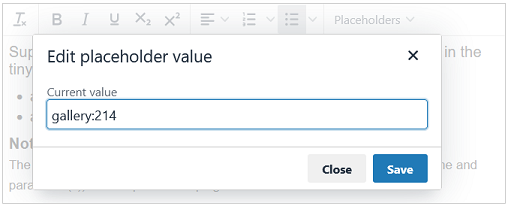

# tinyMCE-Placeholder

 
  
 [](https://www.paypal.me/SKientzler/5.00EUR)

- [Description](#description)
- [Installation](#installation)
  - [Usage as external plugin](#usage-as-external-plugin)
  - [Usage as internal plugin](#usage-as-internal-plugin)
- [Configuration](#configuration)
  - [Defining the available placeholder list](#defining-the-available-placeholder-list)
    - [Static definition in the JS](#static-definition-in-the-js)
	- [Set a URL where the plugin fetches the placeholder list at runtime](#set-a-url-where-the-plugin-fetches-the-placeholder-list-at-runtime)
  - [Add the selectlist to the toolbar](#add-the-selectlist-to-the-toolbar)
  - [Choose the start- and end- tag](#choose-the-start--and-end--tag)
  - [Specify the style to display the placeholders](#specify-the-style-to-display-the-placeholders-within-the-edit-area)
  - [Enable/disable the placeholder edit dialog](#enabledisable-the-placeholder-edit-dialog)
- [Localization](#localization)
- [JS minification](#js-minification)

---
## Description

**Plugin for tinyMCE (Version 6.x) to insert and edit placeholders.**

This plugin supports a defineable selectlist to insert a placeholder into the currrent
edit area. Placeholders are often used/needed to replace some part in a text at runtime 
with any dynamic content.  
A placeholders is specified with a name (possibly with additional parameter(s)), which 
is enclosed within a defined start and end tag. This plugin supports following start- 
and end tags:
- curly_braces:	`{placeholder}`
- square_braces: `[placeholder]`
- double_curly_braces: `{{placeholder}}`    (*e.g. used by the TWIG template engine*)
- double_square_braces: `[[placeholder]]`
- curly_brace_exclamation: `{!placeholder!}`
- square_brace_exclamation: `[!placeholder!]`

To visually differentiate from 'normal' content, the display of placeholders can be 
defined using CSS styles. Existing placeholders are read-only and cannot be edited or 
changed directly in the edit area:


Editing via a dialog (e.g. to enter parameters of a placeholder) can be activated or 
deactivated. If this option is set (default: true), a double click on a placeholder
opens a dialog to edit the value of the placeholder:



## Installation

Download the latest release and save the `placeholder` folder 
1. In any path on your server as 'external plugin'
2. In the 'plugin' folder of your self hosted version of **tinyMCE** to use it as
   'internal plugin'
   
### Usage as 'external plugin'

If you are loading tinyMCE from a CDN or want to separate your custom plugins
from the core installation, you have to load placeholder as external plugin:

```JS
tinymce.init({
  selector: 'your_editor',
  external_plugins: {
    'placeholder': 'http://www.yourdomain.com/yourplugins/placeholder/plugin.min.js',
  }
  ...
});
```

Loading as external plugin, you can use either the `plugin.min.js`or the `plugin.js` 
version - regardless of the version of ***tinyMCE*** (`tinymce.js / tinymce.min.js`)
you have loaded!
> The `.min.js` file is a compressed/minified version of the `.js` file. Using the 
> full version takes longer to load but the source is readable and allows debuging.

For details, especially regarding the absolute or relative path of the plugin URL, 
see:  
https://www.tiny.cloud/docs/tinymce/6/editor-important-options/#external_plugins
   
### Usage as 'internal plugin'

To load placeholder as internal plugin, the `placeholder` folder **MUST** be a
subfolder of the `plugins` directory of your ***tinyMCE*** installation.

```JS
tinymce.init({
  selector: 'your_editor',
  plugins: 'plugin1 ... pluginN placeholder',
  ...
});
```

Dependent on the version of ***tinyMCE*** (`tinymce.js / tinymce.min.js`) you
are loading, the corresponding version of the plugin must be available on your
installation.

For details see:  
https://www.tiny.cloud/docs/tinymce/6/editor-important-options/#plugins

## Configuration

| Option                 | Type    | Description |
|------------------------|---------|-------------|
| `placeholders`         | array   | [Defining the available placeholder list](#defining-the-available-placeholder-list) |
| `placeholder_type`     | string  | [Choose the start- and end- tag](#choose-the-start--and-end--tag) |
| `placeholder_style`    | string  | [Specify the style to display the placeholders](#specify-the-style-to-display-the-placeholders-within-the-edit-area) |
| `placeholder_can_edit` | boolean | [Enable/disable the placeholder edit dialog](#enabledisable-the-placeholder-edit-dialog) |

### Defining the available placeholder list

#### Static definition in the JS

To specify the available placeholders, the option `placeholders` have to be set when
initializing ***tinyMCE***.  

The placeholder list can be defined in short or long form:
- short: Just define an array of strings containing the available placeholders 
  (The placholder name is set to its value!)
- long: define an array of abjects containing `name`and `value` properties. This opens
  the posibility to localize the placeholdernames without changing the internal value.

```JS
// 'long' version
tinymce.init({
  selector: 'your_editor',
  external_plugins: {
    'placeholder': 'http://www.yourdomain.com/yourplugins/placeholder/plugin.min.js',
  }
  placeholders: [
    {
      name:  'First Placeholder',
      value: 'placeholder1'
    }, {
      name:  'Second Placeholder',
      value: 'placeholder2'
    }, {
      name:  'Third Placeholder',
      value: 'placeholder3'
    }
  ],
  ...
});

// 'short' version
tinymce.init({
  selector: 'your_editor',
  external_plugins: {
    'placeholder': 'http://www.yourdomain.com/yourplugins/placeholder/plugin.min.js',
  }
  placeholders: ['placeholder1', 'placeholder2', 'placeholder3']
  ...
});
```

#### Set a URL where the plugin fetches the placeholder list at runtime

Instead of a hardcoded placeholder list in the JS code, a URL where the list will 
be fetched at runtime can be set:

```JS
tinymce.init({
  selector: 'your_editor',
  external_plugins: {
    'placeholder': 'http://www.yourdomain.com/yourplugins/placeholder/plugin.min.js',
  }
  placeholders: 'ajax/placeholders.php',
  ...
});

```

The response of this URL must be a JSON object that conforms to the following format:

```JS
// 'long' version
[
	{
		"text":  "First Placeholder",
		"value": "placeholder1"
	},
	{
		"text":  "Second Placeholder",
		"value": "placeholder2"
	},
	{
		"text":  "Third Placeholder",
		"value": "placeholder3"
	}
]

// 'short' version
["placeholder1", "placeholder2", "placeholder3"]
```

A verry simplified example, how to implement the requesthandler in PHP:

```PHP
<?php
// define available placeholders
$placeholders = [[
        "text"  => "First Placeholder",
        "value" => "placeholder1"
    ], [
        "text"  => "Second Placeholder",
        "value" => "placeholder2"
    ], [
        "text"  => "Third Placeholder",
        "value" => "placeholder3"
    ],
];

header('Content-Type: application/json');
echo json_encode($placeholders);
```

### Add the selectlist to the toolbar

To add the selectmenu to the toolbar, the 'placeholder' keyword can be placed at any 
position within the toolbar definition.

```JS
tinymce.init({
  selector: 'your_editor',
  external_plugins: {
    'placeholder': 'http://www.yourdomain.com/yourplugins/placeholder/plugin.min.js',
  }
  toolbar: 'btn1 btn2 ... btnN | placeholder',
  ...
});
```

### Choose the start- and end- tag

To select the desired type of the start- and end tag, set the `placeholder_type` option.
The default type is 'double_square_braces'.

```JS
tinymce.init({
  selector: 'your_editor',
  external_plugins: {
    'placeholder': 'http://www.yourdomain.com/yourplugins/placeholder/plugin.min.js',
  }
  placeholder_type: 'double_curly_braces',
  ...
});
```

| Available types              | example           |
|------------------------------|-------------------|
| `'curly_braces'`             | `{placeholder}`   |
| `'square_braces'`            | `[placeholder]`   |
| `'double_curly_braces'`      | `{{placeholder}}` |
| `'double_square_braces'`     | `[[placeholder]]` |
| `'curly_brace_exclamation'`  | `{!placeholder!}` |
| `'square_brace_exclamation'` | `[!placeholder!]` |

### Specify the style to display the placeholders within the edit area

To keep placeholders readonly and display them in a differnt style, the ***tinyMCE***
build-in functionality `noneditable_regexp` is used and so we just have to change the 
CSS style for the '.mceNonEditable' class.  

By using the `placeholder_style` - option, this style can be changed. The default 
style is dark blue text on yellow background. To suppress the default style, pass
an empty string to this option!

> Be aware that setting this style may also affect other readonly areas defined using 
> the `noneditable_regexp` functionality

```JS
tinymce.init({
  selector: 'your_editor',
  external_plugins: {
    'placeholder': 'http://www.yourdomain.com/yourplugins/placeholder/plugin.min.js',
  }
  placeholder_style: '{ color: cyan; background-color: darkblue;}',
  ...
});
```

### Enable/disable the placeholder edit dialog

It can be set whether the user can edit existing placeholders in a dialog or not. To 
do this, the `placeholder_can_edit` option must be set to false. This option is 
activated by default.

```JS
tinymce.init({
  selector: 'your_editor',
  external_plugins: {
    'placeholder': 'http://www.yourdomain.com/yourplugins/placeholder/plugin.min.js',
  }
  placeholder_can_edit: false,
  ...
});
```

## Localization

Currently only the german translation for the plugin is available. Following steps are
needed to create additional localizations:
1. Copy the file `de.js` in the langs folder, rename it to the language you want
   to add and make your translations.
2. Add the new language in the `plugin.js` at the last line of the plugin
   ```JS
   // add your language at this point, below e.g. fr for french translation
   tinymce.PluginManager.requireLangPack('placeholder', 'de, fr');
   ```
3. Recreate the minified `plugin.min.js` version 

> **Note:**  
> It would be great if you add your created translation file(s) to the repository 
> via pull request to make them available to other users... or just email me any new 
> translation file(s) :-)

## JS minification

[Terser 5](https://github.com/terser/terser)
: A JavaScript mangler/compressor toolkit for ES6+. Needs latest version of 
[node.js](http://nodejs.org/) to be installed to run it from the terminal. The easiest 
way then is to use the bash script 'minify' which is included in the root of this package.

[Minify-JS](https://minify-js.com/)
: Online tool uses 'Terser 5'

[JCompress](https://jscompress.com/)
: Online tool uses 'UglifyJS 3' and 'babel-minify' (doesn't support ES6)
